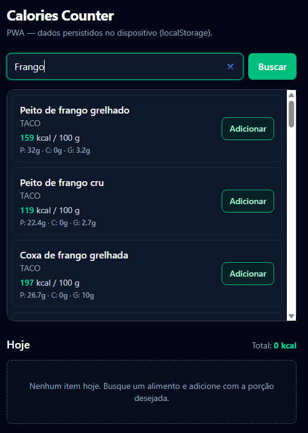
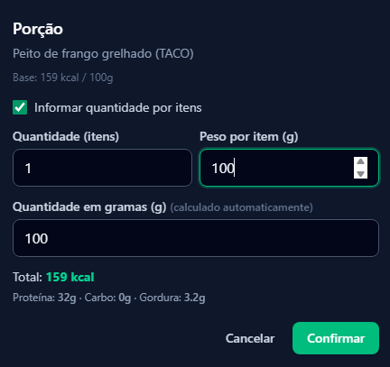
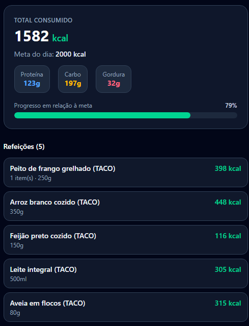

# 🔢 Calories Counter

Aplicação web para registrar refeições e acompanhar o consumo diário de calorias e macronutrientes (proteína, carboidrato e gordura), com metas diárias configuráveis. A busca de alimentos combina uma base local com a API pública [USDA FoodData Central](https://fdc.nal.usda.gov/api-guide.html), o banco de dados nutricional do governo dos EUA.

🔗 **[Acesse a aplicação](https://gabrielmoura-dev.github.io/calories-counter)**

## Preview


Busca de alimentos com tradução PT/ES → EN


Cálculo de porção por quantidade de itens


Resumo diário com metas e macronutrientes

## Funcionalidades

- Busca de alimentos por nome, combinando resultados locais e da USDA FoodData Central
- Busca em português e espanhol: como a USDA FoodData Central só indexa termos em inglês, uma camada de tradução própria (dicionário `TRANSLATIONS` em `src/services/usda.ts`) converte termos comuns em PT/ES para EN antes de consultar a API
- Registro de refeições com porções (gramas ou medidas caseiras)
- Cálculo automático de calorias e macros (proteína, carboidrato, gordura) por refeição e por dia
- Definição de metas diárias de calorias e macronutrientes, com progresso do dia
- Gerenciamento de estado global com Zustand
- Interface responsiva com Tailwind CSS
- Suporte a PWA (Progressive Web App) - instalável no celular

## Tecnologias

<div align="center">


</div>

## Como rodar localmente

### Pré-requisitos

- [Node.js](https://nodejs.org/) (v18+)
- Uma conta gratuita na [USDA FoodData Central API](https://fdc.nal.usda.gov/api-guide.html) para obter uma API key (`api.data.gov`)

### Instalação

```bash
# Clone o repositório
git clone https://github.com/gabrielmoura-dev/calories-counter.git
cd calories-counter

# Instale as dependências
npm install

# Configure as variáveis de ambiente
cp .env.example .env
# Edite o .env com sua API key da USDA FoodData Central

# Rode o projeto
npm run dev
```

## Estrutura do Projeto

```
calories-counter/
├── public/             # Arquivos estáticos
├── src/                # Código-fonte
├── .env.example        # Template de variáveis de ambiente
├── index.html          # Entry point HTML
├── vite.config.ts      # Configuração do Vite + PWA
├── tsconfig.json       # Configuração do TypeScript
└── package.json
```

## Variáveis de Ambiente

| Variável | Descrição |
|----------|-----------|
| `VITE_USDA_API_KEY` | API key da [USDA FoodData Central](https://fdc.nal.usda.gov/api-guide.html), usada para buscar alimentos que não estão na base local |

Crie uma conta gratuita em [fdc.nal.usda.gov/api-guide.html](https://fdc.nal.usda.gov/api-guide.html) para obter sua chave.

## Licença

Este projeto é de uso pessoal/educacional.

<div align="center">

Desenvolvido por [Gabriel Moura](https://github.com/gabrielmoura-dev)

</div>
